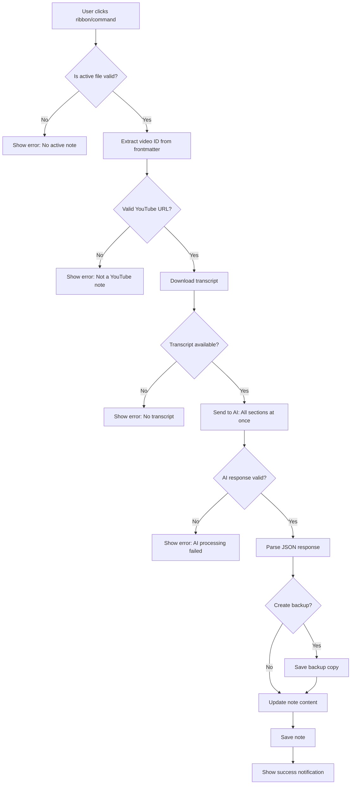

# YouTube Summary Plugin - Technical Specification

## 📌 Overview

**Plugin Name**: YouTube Deep Learning Note Processor
**Version**: 1.0.0
**Platform**: Obsidian
**Language**: TypeScript
**Target**: Process web-clipped YouTube notes with AI-generated summaries

---

## 🎯 Core Requirements

### User Workflow
1. User clips YouTube video using Obsidian Web Clipper
2. Web Clipper creates note with frontmatter (`source_url`) and AI prompt templates
3. User opens the note in Obsidian
4. User clicks ribbon icon OR runs command palette command
5. Plugin extracts video ID from frontmatter
6. Plugin downloads YouTube transcript
7. Plugin sends single AI request with all 7 sections
8. Plugin replaces template prompts with AI-generated content
9. User sees completed note with all sections filled

### Processing Scope
- **Target**: Currently active note only
- **Trigger**: Manual (ribbon icon or command palette)
- **Mode**: Fully automated (all 7 sections required)

---

## 🏗️ Technical Architecture

### Technology Stack

```
Obsidian Plugin (TypeScript)
├── Dependencies
│   ├── obsidian (API)
│   ├── youtube-transcript (npm package)
│   └── @anthropic-ai/sdk (Claude API)
│
├── Core Modules
│   ├── VideoIdExtractor
│   ├── TranscriptDownloader
│   ├── AIProcessor (Claude)
│   └── NoteUpdater
│
└── UI Components
    ├── Ribbon Icon
    ├── Command Palette Commands
    ├── Settings Tab
    └── Status Notifications
```

### Why TypeScript over Python?
✅ No external dependencies (Python runtime not required)
✅ Native Obsidian API integration
✅ Better cross-platform compatibility
✅ Easier distribution (single plugin package)
✅ `youtube-transcript` npm library is mature and reliable

---

## 📦 Module Specifications

### 1. VideoIdExtractor

**Purpose**: Extract YouTube video ID from frontmatter

**Input**:
- Obsidian `TFile` object (current note)

**Output**:
- Video ID (string, 11 characters)
- OR error if not found

**Logic**:
```typescript
interface VideoIdExtractor {
  extract(file: TFile): Result<string, Error>
}

// Supported URL formats:
// - https://www.youtube.com/watch?v=VIDEO_ID
// - https://youtu.be/VIDEO_ID
// - https://www.youtube.com/embed/VIDEO_ID
// - With timestamps: ?v=VIDEO_ID&t=120s
```

**Error Handling**:
- No frontmatter → "No frontmatter found"
- No source_url → "No source_url in frontmatter"
- Invalid URL → "Invalid YouTube URL"

---

### 2. TranscriptDownloader

**Purpose**: Download YouTube transcript using youtube-transcript library

**Input**:
- Video ID (string)
- Language preference (default: ['ko', 'en'])

**Output**:
- Full transcript text (string)
- Video metadata (title, author, duration)
- OR error if download fails

**Implementation**:
```typescript
interface TranscriptDownloader {
  download(
    videoId: string,
    languages?: string[]
  ): Promise<TranscriptResult>
}

interface TranscriptResult {
  text: string;           // Full transcript
  metadata: {
    title: string;
    author: string;
    duration: number;     // seconds
    publishDate?: string;
  };
}
```

**Library**: `youtube-transcript`
```bash
npm install youtube-transcript
```

**Error Handling**:
- No transcript available → "No transcript found for this video"
- Private/deleted video → "Video is unavailable"
- Network error → "Failed to download transcript: [error]"

---

### 3. AIProcessor (Claude API)

**Purpose**: Generate all 7 sections in a single API call

**Input**:
- Transcript text
- Video metadata (title, channel, publish date)
- Section templates (from web clipper)

**Output**:
- Structured response with all 7 sections filled

**API Choice**: Anthropic Claude (claude-3-5-sonnet-20241022)
- ✅ Excellent Korean language support
- ✅ Long context window (200K tokens)
- ✅ Structured output capability
- ✅ High-quality summarization

**Prompt Strategy**:
```typescript
interface AIProcessor {
  processAllSections(
    transcript: string,
    metadata: VideoMetadata,
    templates: SectionTemplates
  ): Promise<ProcessedSections>
}

interface ProcessedSections {
  executiveSummary: string;
  chapterAnalysis: string;
  keyConcepts: string;
  detailedNotes: string;
  actionItems: string;
  feynmanExplanation: string;
}
```

**Single Prompt Structure**:
```
You are processing a YouTube video transcript to create comprehensive learning notes in Korean.

VIDEO METADATA:
- Title: {title}
- Channel: {channel}
- Published: {publishDate}

TRANSCRIPT:
{full_transcript}

Please generate the following 7 sections. Return your response in JSON format:

1. EXECUTIVE SUMMARY
   {prompt from web clipper template}

2. CHAPTER ANALYSIS
   {prompt from web clipper template}

3. KEY CONCEPTS
   {prompt from web clipper template}

4. DETAILED NOTES
   {prompt from web clipper template}

5. ACTION ITEMS
   {prompt from web clipper template}

6. FEYNMAN EXPLANATION
   {prompt from web clipper template}

Return JSON:
{
  "executiveSummary": "...",
  "chapterAnalysis": "...",
  "keyConcepts": "...",
  "detailedNotes": "...",
  "actionItems": "...",
  "feynmanExplanation": "..."
}
```

**Cost Estimation** (per video):
- Input: ~10K tokens (transcript) + 2K tokens (prompts) = 12K tokens
- Output: ~5K tokens (7 sections)
- Cost: ~$0.06 per video (Claude 3.5 Sonnet pricing)

**Error Handling**:
- API key missing → "Please configure Claude API key in settings"
- Rate limit → "Rate limit reached. Please try again later"
- API error → "AI processing failed: [error]"
- Invalid response → "Failed to parse AI response. Please try again"

---

### 4. NoteUpdater

**Purpose**: Replace template prompts with AI-generated content

**Input**:
- Current note content (string)
- Processed sections (ProcessedSections)

**Output**:
- Updated note content (string)

**Logic**:
```typescript
interface NoteUpdater {
  update(
    currentContent: string,
    sections: ProcessedSections
  ): string
}
```

**Replacement Strategy**:
The web clipper template uses this pattern:
```
{{"prompt text"|callout:("type", "title", false)}}
```

We need to:
1. Parse each section's callout template
2. Extract the callout metadata (type, title)
3. Replace the entire `{{...}}` block with:
```markdown
> [!type] title
> generated content here
```

**Example Transformation**:
```markdown
BEFORE:
{{"Summarize this video..."|callout:("summary", "Executive Summary", false)}}

AFTER:
> [!summary] Executive Summary
> 이 영상의 핵심 메시지는... (AI generated content)
```

**Safety**:
- Create backup before modification
- Only replace valid `{{...}}` blocks
- Preserve frontmatter and other content
- Keep "My Notes" section untouched

---

## 🎨 User Interface

### 1. Ribbon Icon

**Icon**: YouTube logo (svg)
```typescript
this.addRibbonIcon('youtube', 'Process YouTube Note', async () => {
  await this.processCurrentNote();
});
```

**Behavior**:
- Click → Process current active note
- Show notification if not a YouTube note
- Disabled state if no active note

### 2. Command Palette

**Command 1**: "YouTube Summary: Process current note"
```typescript
this.addCommand({
  id: 'process-youtube-note',
  name: 'Process current note',
  checkCallback: (checking: boolean) => {
    const activeFile = this.app.workspace.getActiveFile();
    if (activeFile) {
      if (!checking) {
        this.processCurrentNote();
      }
      return true;
    }
    return false;
  }
});
```

**Command 2**: "YouTube Summary: Open Settings"
```typescript
this.addCommand({
  id: 'open-settings',
  name: 'Open Settings',
  callback: () => {
    this.app.setting.open();
    this.app.setting.openTabById(this.manifest.id);
  }
});
```

### 3. Status Notifications

**Progress Updates**:
```typescript
// Stage 1: Extraction
new Notice('📹 Extracting video ID...');

// Stage 2: Download
new Notice('📥 Downloading transcript...', 4000);

// Stage 3: AI Processing
new Notice('🤖 Generating AI summary... (this may take 30-60s)', 60000);

// Stage 4: Success
new Notice('✅ Note processing completed!', 5000);

// Errors
new Notice('❌ Error: [error message]', 8000);
```

**Visual Feedback**:
- Use Obsidian's Notice API for non-intrusive updates
- Show estimated time for long operations
- Clear error messages with actionable advice

### 4. Settings Tab

```typescript
interface YouTubeSummarySettings {
  // AI Configuration
  aiProvider: 'claude' | 'openai' | 'custom';
  claudeApiKey: string;
  openaiApiKey?: string;
  customApiEndpoint?: string;

  // Transcript Settings
  preferredLanguages: string[];  // default: ['ko', 'en']
  includeTimestamps: boolean;    // default: false

  // Processing Options
  autoSave: boolean;              // default: true
  createBackup: boolean;          // default: true

  // Advanced
  maxRetries: number;             // default: 3
  timeoutSeconds: number;         // default: 120
}
```

**Settings UI**:
```typescript
class YouTubeSummarySettingTab extends PluginSettingTab {
  display(): void {
    // API Key section
    new Setting(containerEl)
      .setName('Claude API Key')
      .setDesc('Get your API key from console.anthropic.com')
      .addText(text => text
        .setPlaceholder('sk-ant-...')
        .setValue(this.plugin.settings.claudeApiKey)
        .onChange(async (value) => {
          this.plugin.settings.claudeApiKey = value;
          await this.plugin.saveSettings();
        }));

    // Language preferences
    new Setting(containerEl)
      .setName('Preferred Languages')
      .setDesc('Comma-separated language codes (e.g., ko,en)')
      .addText(text => text
        .setValue(this.plugin.settings.preferredLanguages.join(','))
        .onChange(async (value) => {
          this.plugin.settings.preferredLanguages =
            value.split(',').map(s => s.trim());
          await this.plugin.saveSettings();
        }));

    // Backup option
    new Setting(containerEl)
      .setName('Create Backup')
      .setDesc('Create backup before modifying note')
      .addToggle(toggle => toggle
        .setValue(this.plugin.settings.createBackup)
        .onChange(async (value) => {
          this.plugin.settings.createBackup = value;
          await this.plugin.saveSettings();
        }));
  }
}
```

---

## 🔄 Processing Flow



**Estimated Processing Time**:
1. Extract video ID: <100ms
2. Download transcript: 1-3 seconds
3. AI processing: 30-60 seconds
4. Update note: <500ms

**Total**: ~35-65 seconds per note

---

## 🛡️ Error Handling & Edge Cases

### 1. Input Validation

**Invalid Note Types**:
```typescript
// Check 1: Is there an active file?
if (!activeFile) {
  new Notice('❌ No active note. Please open a note first.');
  return;
}

// Check 2: Does it have frontmatter?
const cache = this.app.metadataCache.getFileCache(activeFile);
if (!cache?.frontmatter) {
  new Notice('❌ No frontmatter found. Is this a YouTube note?');
  return;
}

// Check 3: Does it have source_url?
const sourceUrl = cache.frontmatter.source_url;
if (!sourceUrl) {
  new Notice('❌ No source_url found in frontmatter.');
  return;
}

// Check 4: Is it a YouTube URL?
const videoId = this.extractVideoId(sourceUrl);
if (!videoId) {
  new Notice('❌ Invalid YouTube URL.');
  return;
}
```

### 2. Network Issues

```typescript
async downloadTranscript(videoId: string): Promise<TranscriptResult> {
  const maxRetries = this.settings.maxRetries;
  let lastError: Error;

  for (let i = 0; i < maxRetries; i++) {
    try {
      const transcript = await YoutubeTranscript.fetchTranscript(videoId);
      return this.parseTranscript(transcript);
    } catch (error) {
      lastError = error;
      if (i < maxRetries - 1) {
        await this.sleep(1000 * (i + 1)); // Exponential backoff
      }
    }
  }

  throw new Error(`Failed after ${maxRetries} attempts: ${lastError.message}`);
}
```

### 3. API Failures

```typescript
async processWithAI(
  transcript: string,
  metadata: VideoMetadata
): Promise<ProcessedSections> {
  try {
    const response = await this.claude.messages.create({
      model: 'claude-3-5-sonnet-20241022',
      max_tokens: 8000,
      temperature: 0.7,
      messages: [{
        role: 'user',
        content: this.buildPrompt(transcript, metadata)
      }]
    });

    return this.parseAIResponse(response);
  } catch (error) {
    if (error.status === 429) {
      throw new Error('Rate limit reached. Please wait a few minutes.');
    } else if (error.status === 401) {
      throw new Error('Invalid API key. Please check your settings.');
    } else {
      throw new Error(`AI processing failed: ${error.message}`);
    }
  }
}
```

### 4. Content Parsing Issues

```typescript
parseAIResponse(response: any): ProcessedSections {
  try {
    const content = response.content[0].text;

    // Try to extract JSON from response
    const jsonMatch = content.match(/\{[\s\S]*\}/);
    if (!jsonMatch) {
      throw new Error('No JSON found in AI response');
    }

    const parsed = JSON.parse(jsonMatch[0]);

    // Validate all required sections
    const required = [
      'executiveSummary',
      'chapterAnalysis',
      'keyConcepts',
      'detailedNotes',
      'actionItems',
      'feynmanExplanation'
    ];

    for (const field of required) {
      if (!parsed[field]) {
        throw new Error(`Missing required section: ${field}`);
      }
    }

    return parsed as ProcessedSections;
  } catch (error) {
    throw new Error(`Failed to parse AI response: ${error.message}`);
  }
}
```

### 5. Backup & Recovery

```typescript
async createBackup(file: TFile): Promise<void> {
  if (!this.settings.createBackup) return;

  const content = await this.app.vault.read(file);
  const backupPath = file.path.replace(/\.md$/, `.backup-${Date.now()}.md`);

  await this.app.vault.create(backupPath, content);
  console.log(`Backup created: ${backupPath}`);
}

async safeUpdate(file: TFile, newContent: string): Promise<void> {
  try {
    await this.createBackup(file);
    await this.app.vault.modify(file, newContent);
  } catch (error) {
    new Notice('❌ Failed to update note. Backup was created.');
    throw error;
  }
}
```

---

## 📚 Dependencies

### Required NPM Packages

```json
{
  "dependencies": {
    "obsidian": "latest",
    "@anthropic-ai/sdk": "^0.27.0",
    "youtube-transcript": "^1.2.1"
  },
  "devDependencies": {
    "@types/node": "^20.0.0",
    "typescript": "^5.0.0",
    "esbuild": "^0.19.0"
  }
}
```

### Installation
```bash
npm install
npm run build
```

---

## 🔐 Security Considerations

### 1. API Key Storage
```typescript
// Store API keys securely using Obsidian's data.json
// Keys are NOT committed to git
async loadSettings() {
  this.settings = Object.assign(
    {},
    DEFAULT_SETTINGS,
    await this.loadData()
  );
}

async saveSettings() {
  await this.saveData(this.settings);
}
```

### 2. Input Sanitization
```typescript
sanitizeVideoId(id: string): string {
  // Only allow alphanumeric, dash, underscore (YouTube video ID format)
  return id.replace(/[^a-zA-Z0-9_-]/g, '');
}
```

### 3. Rate Limiting
```typescript
class RateLimiter {
  private lastRequest: number = 0;
  private minInterval: number = 1000; // 1 second between requests

  async throttle(): Promise<void> {
    const now = Date.now();
    const elapsed = now - this.lastRequest;

    if (elapsed < this.minInterval) {
      await this.sleep(this.minInterval - elapsed);
    }

    this.lastRequest = Date.now();
  }
}
```

---

## 🧪 Testing Strategy

### Unit Tests
```typescript
describe('VideoIdExtractor', () => {
  test('extracts ID from standard URL', () => {
    const url = 'https://www.youtube.com/watch?v=dQw4w9WgXcQ';
    expect(extractVideoId(url)).toBe('dQw4w9WgXcQ');
  });

  test('extracts ID from short URL', () => {
    const url = 'https://youtu.be/dQw4w9WgXcQ';
    expect(extractVideoId(url)).toBe('dQw4w9WgXcQ');
  });

  test('handles timestamp URLs', () => {
    const url = 'https://www.youtube.com/watch?v=dQw4w9WgXcQ&t=120s';
    expect(extractVideoId(url)).toBe('dQw4w9WgXcQ');
  });
});
```

### Integration Tests
```typescript
describe('End-to-End Processing', () => {
  test('processes complete note', async () => {
    const mockFile = createMockFile();
    const result = await plugin.processCurrentNote();

    expect(result).toBeDefined();
    expect(result.executiveSummary).toContain('핵심');
    expect(result.chapterAnalysis).toContain('챕터');
  });
});
```

### Manual Test Cases
1. ✅ Process note with Korean transcript
2. ✅ Process note with English transcript
3. ✅ Handle video with no transcript
4. ✅ Handle private/deleted video
5. ✅ Handle invalid URL
6. ✅ Handle API key missing
7. ✅ Handle network timeout
8. ✅ Verify backup creation
9. ✅ Test with long transcript (>100K tokens)
10. ✅ Test all 7 sections generated correctly

---

## 📈 Performance Optimization

### 1. Caching Strategy
```typescript
interface TranscriptCache {
  [videoId: string]: {
    transcript: string;
    metadata: VideoMetadata;
    timestamp: number;
  }
}

// Cache transcripts for 24 hours
async getCachedTranscript(videoId: string): Promise<TranscriptResult | null> {
  const cached = this.cache[videoId];
  if (!cached) return null;

  const age = Date.now() - cached.timestamp;
  if (age > 24 * 60 * 60 * 1000) {
    delete this.cache[videoId];
    return null;
  }

  return cached;
}
```

### 2. Lazy Loading
```typescript
// Only load AI SDK when needed
private claude: Anthropic | null = null;

private getClaudeClient(): Anthropic {
  if (!this.claude) {
    this.claude = new Anthropic({
      apiKey: this.settings.claudeApiKey
    });
  }
  return this.claude;
}
```

### 3. Streaming (Future Enhancement)
```typescript
// Optional: Stream AI responses for better UX
async processWithStreaming(
  transcript: string,
  onProgress: (section: string) => void
): Promise<ProcessedSections> {
  // Implementation for streaming responses
  // Show each section as it's generated
}
```

---

## 🚀 Future Enhancements (v2.0+)

### Phase 2 Features
1. **Batch Processing**
   - Process entire folder of YouTube notes
   - Queue system for multiple videos
   - Progress dashboard

2. **Custom Templates**
   - User-defined section templates
   - Conditional sections
   - Template marketplace

3. **Multi-AI Support**
   - OpenAI GPT-4
   - Local LLMs (Ollama)
   - AI provider switching

4. **Advanced Features**
   - Timestamp-linked notes
   - Video chapter detection
   - Auto-tagging based on content
   - Translation support

5. **Analytics**
   - Token usage tracking
   - Cost estimation
   - Processing statistics

---

## 📖 Documentation Requirements

### README.md
- Installation instructions
- Quick start guide
- Settings configuration
- Troubleshooting

### CHANGELOG.md
- Version history
- Breaking changes
- Bug fixes

### API Documentation
- TypeScript interfaces
- Function signatures
- Usage examples

---

## ✅ Definition of Done

### MVP (v1.0.0) Checklist
- [ ] Video ID extraction from frontmatter
- [ ] Transcript download via youtube-transcript
- [ ] Claude API integration
- [ ] Single-prompt processing for all 7 sections
- [ ] Note content replacement
- [ ] Ribbon icon
- [ ] Command palette commands
- [ ] Settings tab with API key configuration
- [ ] Status notifications
- [ ] Error handling
- [ ] Backup creation
- [ ] Documentation (README, settings guide)
- [ ] Manual testing (10 test cases)
- [ ] Released on GitHub

### Success Metrics
- ✅ Process time: <70 seconds per video
- ✅ Success rate: >95% for videos with transcripts
- ✅ User satisfaction: Clear error messages, good UX
- ✅ Cost: <$0.10 per video processed

---

## 🗂️ Project Structure

```
youtube-summary-plugin/
├── src/
│   ├── main.ts                 # Plugin entry point
│   ├── settings.ts             # Settings interface & tab
│   ├── processors/
│   │   ├── videoIdExtractor.ts
│   │   ├── transcriptDownloader.ts
│   │   ├── aiProcessor.ts
│   │   └── noteUpdater.ts
│   ├── types/
│   │   └── index.ts            # TypeScript interfaces
│   └── utils/
│       ├── errors.ts
│       └── helpers.ts
├── styles.css                  # Plugin styles (if needed)
├── manifest.json              # Obsidian plugin manifest
├── package.json
├── tsconfig.json
├── README.md
└── CHANGELOG.md
```

---

## 🎬 Implementation Priority

### Sprint 1: Core Infrastructure (Week 1)
1. Project setup (TypeScript, build config)
2. Video ID extractor
3. Transcript downloader
4. Basic error handling

### Sprint 2: AI Integration (Week 2)
1. Claude API integration
2. Prompt engineering (all 7 sections)
3. Response parsing
4. Testing with real transcripts

### Sprint 3: Note Processing (Week 3)
1. Template parser
2. Content replacement logic
3. Backup system
4. Save & validation

### Sprint 4: UI & Polish (Week 4)
1. Ribbon icon
2. Command palette
3. Settings tab
4. Status notifications
5. Documentation

### Sprint 5: Testing & Release (Week 5)
1. Manual testing (all test cases)
2. Bug fixes
3. README & guides
4. GitHub release

---

## 💰 Cost Estimation

### Development
- **Time**: 4-5 weeks (1 developer)
- **Effort**: ~80-100 hours

### Running Costs (per user)
- **Claude API**: ~$0.06 per video
- **Expected usage**: 10 videos/month = $0.60/month
- **Annual**: ~$7.20/user/year

### Infrastructure
- **Hosting**: $0 (users provide own API keys)
- **Support**: Minimal (open source)

---

## 📝 Notes

### Key Design Decisions
1. **Single AI Request**: All sections in one prompt reduces cost & latency
2. **TypeScript Only**: Removes Python dependency for easier distribution
3. **User API Keys**: No backend needed, users control their costs
4. **Manual Trigger**: Prevents accidental processing and API charges
5. **Backup System**: Safety net for content modification

### Assumptions
- Users have Claude API access
- Users are comfortable managing API keys
- Video transcripts are available (most popular videos have them)
- Web Clipper template format is stable

### Risks & Mitigations
| Risk | Impact | Mitigation |
|------|--------|-----------|
| API costs too high | Users stop using | Clear cost warnings, caching |
| Transcript unavailable | Processing fails | Clear error message, manual fallback |
| AI response invalid | Content loss | Validation, backup system |
| Web Clipper template changes | Plugin breaks | Version detection, flexible parsing |

---

**Document Version**: 1.0
**Last Updated**: 2026-01-07
**Status**: Ready for Implementation ✅
